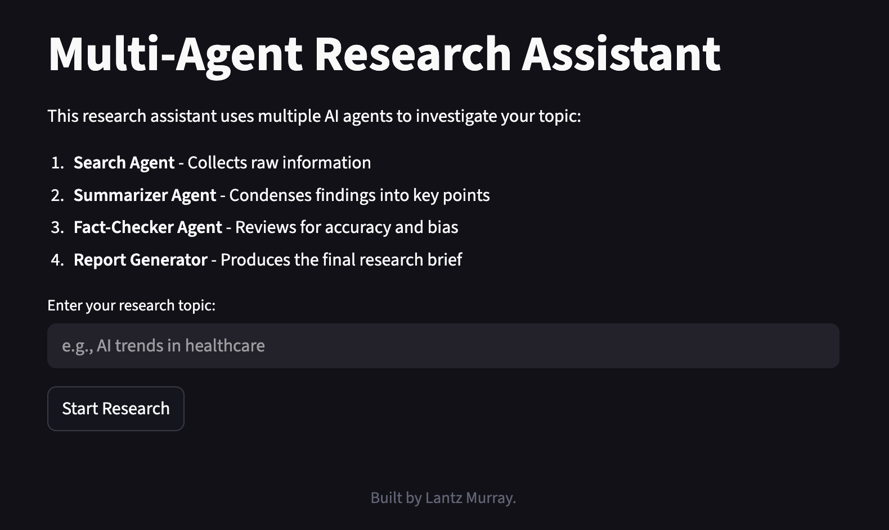

# Project 11: Multi-Agent Research Assistant

A team of specialized AI agents that collaborate like human analysts to produce comprehensive research reports. Perfect for complex research tasks requiring multiple perspectives and thorough analysis.

## Screenshot



## Features

- **Multi-Agent Collaboration**: Four specialized AI agents work together on research tasks
- **Search Agent**: Collects raw information from multiple sources
- **Summarizer Agent**: Condenses findings into concise insights
- **Fact-Checker Agent**: Reviews for hallucinations, bias, or gaps
- **Report Generator**: Produces polished final research briefs
- **CrewAI-Style Orchestration**: Coordinates agent workflows efficiently
- **Local Processing**: All analysis runs locally using Ollama LLMs - no external API dependencies

## Architecture

### Core Agents

1. **Search Agent** (`agents/search_agent.py`)
   - Collects raw information on research topics
   - Performs web searches
   - Gathers background context

2. **Summarizer Agent** (`agents/summarize_agent.py`)
   - Condenses findings into concise insights
   - Creates 3-bullet point summaries
   - Identifies key themes

3. **Checker Agent** (`agents/checker_agent.py`)
   - Reviews for hallucinations
   - Identifies potential bias
   - Finds gaps in information

4. **Report Agent** (`agents/report_agent.py`)
   - Produces polished final research briefs
   - Formats findings professionally
   - Creates executive-style reports

### Supporting Components

- **Orchestrator** (`orchestrator.py`) - Coordinates agent workflows
- **Streamlit Frontend** (`frontend.py`) - User interface for research
- **Shared Base** (`agents/base.py`) - Common LLM utilities

## Installation

### Prerequisites

- Python 3.8 or higher
- Ollama installed and running (for local LLM inference)

### Setup Steps

1. **Navigate to the project directory**:
   ```bash
   cd SchoolOfAI/Official/soai-11-multi-agent
   ```

2. **Create a virtual environment**:
   ```bash
   python -m venv venv
   source venv/bin/activate  # On Windows: venv\Scripts\activate
   ```

3. **Install dependencies**:
   ```bash
   pip install -r requirements.txt
   ```

4. **Install and start Ollama** (if not already installed):
   ```bash
   # Install Ollama from https://ollama.com
   # Pull a model (llama2 is recommended)
   ollama pull llama2
   # Start Ollama service
   ollama serve
   ```

## Running the Application

1. **Start the Streamlit application**:
   ```bash
   streamlit run frontend.py
   ```

2. **Open your browser**: Navigate to `http://localhost:8501`

## Usage

### 1. Enter Research Topic

- Type your research topic in the input field
- Examples: "AI trends in healthcare", "Climate change policy"
- Be specific for better results

### 2. Run Multi-Agent Analysis

- Click "Research" to start the multi-agent workflow
- Watch as agents collaborate sequentially
- View real-time updates from each agent

### 3. Review Results

- **Search Notes**: Raw information collected
- **Summary**: 3-bullet point condensed insights
- **Fact-Check**: Feedback on accuracy and bias
- **Final Report**: Polished executive-style brief

## Workflow

```
User Input → Search Agent → Summarizer Agent → Checker Agent → Report Agent
     ↓              ↓                    ↓                  ↓              ↓
  Enter topic  Collect raw       Condense to        Review for      Generate
              information       3-bullet points   accuracy       polished report
```

## Configuration

### Environment Variables (Optional)

Create a `.env` file in the project root:

```env
OLLAMA_MODEL=llama2
OLLAMA_API_URL=http://localhost:11434/api/generate
```

### Ollama Models

The system supports any Ollama model. Recommended models:
- `llama2` - Good balance of speed and accuracy
- `mistral` - Faster inference

## Project Structure

```
soai-11-multi-agent/
├── agents/
│   ├── base.py                    # Shared LLM utilities
│   ├── search_agent.py            # Collects raw information
│   ├── summarize_agent.py          # Condenses findings
│   ├── checker_agent.py           # Reviews for accuracy
│   └── report_agent.py            # Generates final reports
├── components.py                 # Reusable UI components
├── frontend.py                  # Streamlit UI
├── orchestrator.py               # Agent workflow coordination
├── requirements.txt              # Python dependencies
└── README.md                   # This file
```

## Dependencies

- `streamlit` - Web UI framework
- `requests` - HTTP client for Ollama API
- `tinydb` - Lightweight JSON database
- `python-dateutil` - Date/time parsing

## Troubleshooting

### Ollama Connection Issues

If you see connection errors:
1. Verify Ollama is running: `ollama list`
2. Check the API URL: `curl http://localhost:11434/api/generate`
3. Ensure the model is pulled: `ollama pull llama2`

### Agent Execution Issues

If agents aren't running properly:
1. Check that all agent files are present
2. Verify the orchestrator is calling agents in correct order
3. Review the ERROR.txt file for any logged issues

### Slow Performance

For faster research:
1. Use a smaller model like `mistral`
2. Reduce the complexity of research topics
3. Increase Ollama's GPU resources if available

### Fact-Checking Issues

If fact-checking isn't working:
1. Verify the checker agent is receiving the summary
2. Check that the LLM is providing structured feedback
3. Review the prompts in the checker agent

## Use Cases

- **Research Assistance**: Quick research on any topic
- **Fact-Checking**: Verify information accuracy
- **Report Generation**: Create professional briefs
- **Multi-Perspective Analysis**: Get balanced insights
- **Educational Tool**: Learn about multi-agent systems

## Key Concepts

### CrewAI-Style Orchestration

The system implements a simplified CrewAI pattern:
- Each agent specializes in one task
- Agents work sequentially (not in parallel)
- Output of one agent becomes input to the next
- Orchestrator manages the workflow

### Agent Specialization

Each agent has a specific role:
- **Search**: Information gathering
- **Summarizer**: Condensation and synthesis
- **Checker**: Quality control and verification
- **Report**: Presentation and formatting

### Extensibility

Designed to evolve into:
- **LangGraph** - More complex agent interactions
- **AutoGen** - Autonomous agent conversations
- **CrewAI** - Full CrewAI integration
- **Agentic Workflows with Memory** - Persistent knowledge

## Important Notes

- All processing happens locally - no data is sent to external servers
- Research quality depends on the specificity of the topic
- Fact-checking is AI-based and may not catch all errors
- Agents work sequentially, not in parallel
- Mac users may need to adjust timeout settings (see base.py)

## License

This project is part of the School of AI curriculum.
